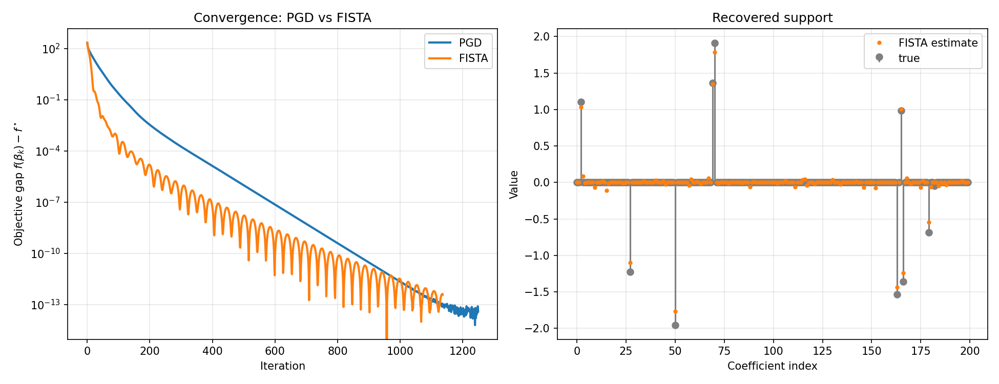

## Le problème

En apprentissage statistique, on cherche souvent à minimiser une perte sous une contrainte de régularisation. La **contrainte $\ell_1$** est particulièrement intéressante : elle induit la **sparsité** des solutions, c'est-à-dire qu'elle pousse les coordonnées inutiles exactement à zéro, réalisant ainsi une sélection de variables automatique.

Le problème considéré est :

$$
\min_{x \in \mathbb{R}^n} f(x) \quad \text{s.c.} \quad \|x\|_1 \leq \tau
$$

où $f$ est convexe et différentiable (typiquement la perte quadratique $f(x) = \frac{1}{2}\|Ax - b\|_2^2$) et $\tau > 0$ contrôle le budget de sparsité. Ce problème est équivalent au **Lasso** sous forme contrainte.

## Descente de gradient projetée

La **descente de gradient projetée** (PGD) généralise la descente de gradient au cas contraint. À chaque itération, on effectue un pas de gradient non contraint, puis on projette le résultat sur l'ensemble admissible $\mathcal{C} = \\\{x : \|x\|_1 \leq \tau\\\}$ :

$$
x_{k+1} = \Pi_{\mathcal{C}}\!\left(x_k - \eta \nabla f(x_k)\right)
$$

où $\eta > 0$ est le pas et $\Pi_{\mathcal{C}}$ est la projection euclidienne sur $\mathcal{C}$ :

$$
\Pi_{\mathcal{C}}(v) = \underset{x \,:\, \|x\|_1 \leq \tau}{\arg\min} \; \|x - v\|_2^2
$$

### Convergence

Lorsque $f$ est $L$-lisse (i.e. $\nabla f$ est $L$-Lipschitz), avec un pas fixe $\eta = 1/L$, la PGD converge à vitesse $\mathcal{O}(1/k)$ sur la valeur de la fonction :

$$
f(x_k) - f(x^*) \leq \frac{L\|x_0 - x^*\|_2^2}{2k}
$$

Si de plus $f$ est $\mu$-fortement convexe, la convergence devient **linéaire** :

$$
\|x_k - x^*\|_2^2 \leq \left(1 - \frac{\mu}{L}\right)^k \|x_0 - x^*\|_2^2
$$

Le ratio $L/\mu$ est le **nombre de condition** du problème — plus il est grand, plus la convergence est lente.

## Accélération : FISTA

La vitesse $\mathcal{O}(1/k)$ de la PGD peut être améliorée sans surcoût notable par itération. **FISTA** (*Fast Iterative Shrinkage-Thresholding Algorithm*) ajoute un terme d'inertie de Nesterov : le gradient est évalué non pas en $x_k$, mais en un point extrapolé $z_k$.

$$
x_{k+1} = \Pi_{\mathcal{C}}\!\left(z_k - \eta \nabla f(z_k)\right), \qquad
z_{k+1} = x_{k+1} + \frac{\theta_k - 1}{\theta_{k+1}}\left(x_{k+1} - x_k\right)
$$

avec $\theta_{k+1} = \tfrac{1}{2}\big(1 + \sqrt{1 + 4\theta_k^2}\big)$. Au même coût par itération, la borne de convergence passe de $\mathcal{O}(1/k)$ à $\mathcal{O}(1/k^2)$. Le dépôt fournit les deux solveurs (PGD et FISTA), partageant la même projection.

## Projection sur la boule $\ell_1$

C'est le cœur algorithmique du projet. Contrairement à la boule $\ell_2$ (projection par simple normalisation) ou à la boîte $\ell_\infty$ (clipping coordonné), la projection sur la boule $\ell_1$ n'admet pas de forme fermée immédiate.

### Caractérisation via les conditions KKT

Le problème de projection étant convexe, les conditions KKT sont nécessaires et suffisantes. En introduisant le multiplicateur de Lagrange $\lambda \geq 0$ pour la contrainte $\|x\|_1 \leq \tau$, la solution optimale $x^*$ vérifie :

$$
x^* = \mathcal{S}_\lambda(v), \quad \text{où} \quad \mathcal{S}_\lambda(v)_i = \mathrm{sign}(v_i)\max(|v_i| - \lambda, 0)
$$

et $\mathcal{S}_\lambda$ est l'opérateur de **seuillage doux** (soft-thresholding). Le seuil $\lambda^*$ est l'unique valeur telle que $\|\mathcal{S}_{\lambda^*}(v)\|_1 = \tau$ (si $\|v\|_1 > \tau$, sinon $x^* = v$).

### Calcul du seuil optimal en $\mathcal{O}(n \log n)$

L'algorithme de Duchi et al. (2008) calcule $\lambda^*$ analytiquement après tri. On pose $u = \mathrm{sort}(|v|, \downarrow)$ et on cherche $\rho$, le plus grand indice tel que :

$$
u_\rho - \frac{1}{\rho}\left(\sum_{j=1}^\rho u_j - \tau\right) > 0
$$

Le seuil optimal est alors :

$$
\lambda^* = \frac{1}{\rho}\left(\sum_{j=1}^\rho u_j - \tau\right)
$$

et la projection s'écrit $x^*_i = \mathrm{sign}(v_i)\max(|v_i| - \lambda^*, 0)$. Le coût dominant est le tri : $\mathcal{O}(n \log n)$.

### Intuition géométrique

La boule $\ell_1$ est un polytope (en 2D, un carré orienté à 45°) dont les sommets sont portés par les axes de coordonnées. Projeter un point extérieur revient à le "ramener" vers le sommet le plus proche, ce qui annule naturellement certaines coordonnées — d'où la sparsité induite.

## Implémentation et validation

Les deux solveurs sont implémentés en Python avec NumPy (vectorisation intégrale), couverts par une suite de tests `pytest` exécutée en intégration continue (GitHub Actions).

La correction est vérifiée contre `scikit-learn` en exploitant l'équivalence entre Lasso pénalisé et Lasso contraint : si $\beta^\star$ résout le problème pénalisé, il résout aussi le problème contraint de rayon $\tau = \|\beta^\star\|_1$. On ajuste `sklearn.linear_model.Lasso`, on lit le rayon $\tau$, puis on résout le problème contraint — les solutions coïncident à $\sim 10^{-7}$ près.

Sur données synthétiques ($n = 100$, $p = 200$, sparsité $10$), les deux méthodes convergent vers le même optimum et reconstruisent le support ; FISTA atteint une précision donnée en nettement moins d'itérations.

---

**Code source :** [GitHub](https://github.com/marouanedaoudi/L1BallPGD)
