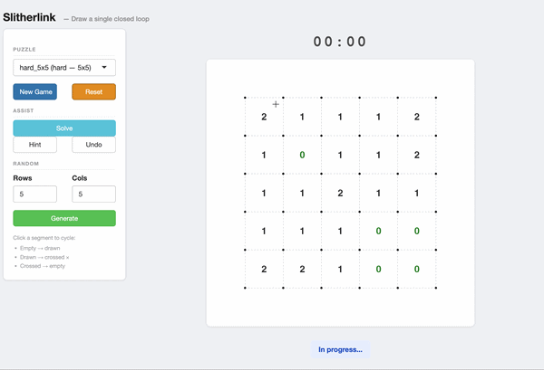

## The Puzzle

**Slitherlink** is a Japanese logic puzzle: on an $(n+1) \times (m+1)$ grid of dots, you must connect adjacent dots to form a **single closed loop** — no branching, no crossing, no dead ends. The numbers inside the cells constrain how many of their sides belong to the loop.

What appears simple on the surface hides a rich combinatorial structure. An $n \times m$ grid has $n(m+1) + m(n+1) = 2nm + n + m$ segments, each of which can be drawn or not — the raw search space is therefore of size $2^{2nm+n+m}$. The clues reduce this space, sometimes down to a unique solution.

## Modeling

Each segment is assigned a state $x_s \in \{0, 1\}$. The cell constraints are written:

$$
\forall (i,j),\quad \sum_{s \in \partial(i,j)} x_s = c_{i,j}
$$

where $\partial(i,j)$ denotes the four segments bordering cell $(i,j)$. These local constraints are necessary but not sufficient: the solution must also form a **simple loop**. Formally, letting $G = (V, E)$ be the graph whose vertices are the grid nodes and whose edges are the drawn segments ($x_s = 1$), we require:

$$
\forall v \in V,\quad \deg_G(v) \in \{0, 2\} \quad \text{and} \quad G \text{ is connected on } \{v : \deg_G(v) > 0\}
$$

The degree condition $\{0,2\}$ rules out branching and dead ends; connectivity ensures the uniqueness of the loop.

## Solving: Constraint Propagation + Backtracking

### Constraint Propagation

For each cell $(i,j)$, let $k$ be the number of segments already drawn ($x_s = 1$) and $u$ the number of still-undetermined segments among its four borders. The constraint $\sum_{s \in \partial(i,j)} x_s = c_{i,j}$ allows us to deduce:

- if $k = c_{i,j}$: the $u$ undetermined segments are all forced to $0$,
- if $k + u = c_{i,j}$: the $u$ undetermined segments are all forced to $1$.

These deductions are propagated cell by cell, repeating as long as at least one segment is fixed per pass — this is a fixed point of the constraint system. On well-formed puzzles, this phase often solves the grid entirely, or reduces the number of undetermined segments to a handful.

### Backtracking

When propagation reaches its fixed point without resolving everything, we are left with a subset $\mathcal{U}$ of undetermined segments. The solver picks some $s^* \in \mathcal{U}$ and explores both branches $x_{s^*} = 1$ then $x_{s^*} = 0$, relaunching propagation each time. On contradiction — a cell whose fixed segments already exceed its clue, or conversely can no longer reach it — the solver backtracks.

The search tree has depth at most $|\mathcal{U}|$, but thanks to propagation, each branch fixes many other segments in cascade: in practice, backtracking rarely reaches significant depth.

### Topology Check

Loop validation relies on a **depth-first traversal** of the graph $G$ of drawn segments. We simultaneously verify that each active node has degree exactly $2$ and that the traversal from any active node visits all active nodes — which is equivalent to saying that $G$ is a Hamiltonian cycle on its own vertices.

## Shiny App

The package includes an interactive interface for playing, exploring and solving puzzles in real time. Each segment state toggles on click (empty → drawn → crossed), constraint validity is checked after every move, and a timer tracks solving time. A hint system reveals a correct segment on demand; the solver can step in at any moment to display the full solution.

---

**Documentation:** [marouanedaoudi.github.io/slitherlink-shiny](https://marouanedaoudi.github.io/slitherlink-shiny/) · **Source code:** [GitHub](https://github.com/marouanedaoudi/slitherlink-shiny)
